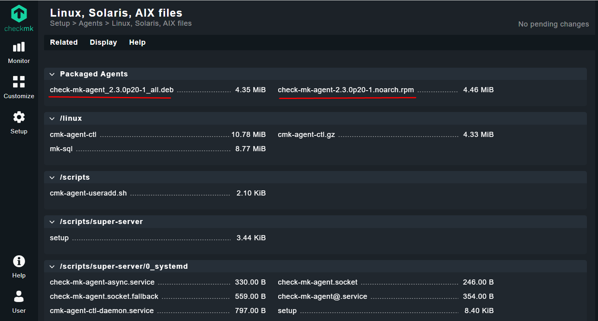
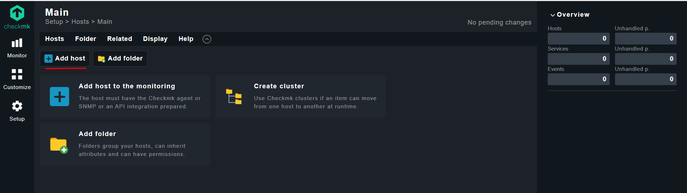
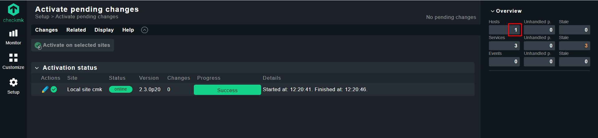

## Install Checkmk on Rocky Linux:

Checkmk is a powerful IT monitoring tool that provides comprehensive insights into your infrastructure. **Checkmk Raw is free, 100 % Open Source** and incorporates Nagios as its core. You can use it to comprehensively monitor complex environments. 


### Installation on RHEL/Centos:

With Red Hat and all its derivatives such as CentOS, AlmaLinux or Rocky Linux, the EPEL (Extra Packages for Enterprise Linux) repository must be set up as a package source.

```
wget https://download.checkmk.com/checkmk/2.3.0p20/check-mk-raw-2.3.0p20-el8-38.x86_64.rpm
```


```
yum install check-mk-raw-2.3.0p20-el8-38.x86_64.rpm
```


```
omd version

OMD - Open Monitoring Distribution Version 2.3.0p20.cre
```


### Create a Checkmk monitoring site:

```
omd create mysite
```


```
### Output:

Adding /opt/omd/sites/mysite/tmp to /etc/fstab.
Creating temporary filesystem /omd/sites/mysite/tmp...OK
Updating core configuration...
Generating configuration for core (type nagios)...
Precompiling host checks...OK
Executing post-create script "01_create-sample-config.py"...OK
Executing post-create script "02_cmk-compute-api-spec"...OK
Restarting Apache...OK
Created new site mysite with version 2.3.0p20.cre.

  The site can be started with omd start mysite.
  The default web UI is available at http://rcms01/mysite/

  The admin user for the web applications is cmkadmin with password: Sh9wNH4aW6Hq
  For command line administration of the site, log in with 'omd su mysite'.
  After logging in, you can change the password for cmkadmin with 'cmk-passwd cmkadmin'.
```


```
omd status


### Output:

Doing 'status' on site mysite:
agent-receiver: stopped
mkeventd:       stopped
rrdcached:      stopped
npcd:           stopped
nagios:         stopped
apache:         stopped
redis:          stopped
crontab:        stopped
-----------------------
Overall state:  stopped
```


```
su - mysite
```


```
pwd

/omd/sites/mysite
```


```
cmk-passwd cmkadmin

New password: cmkadmin
Re-type new password: 
```


```
omd start


### Output:

Temporary filesystem already mounted
Starting agent-receiver...OK
Starting mkeventd...OK
Starting rrdcached...OK
Starting npcd...OK
Starting nagios...OK
Starting apache...OK
Starting redis...OK
Initializing Crontab...OK
```


### Web Console:

Web interface is available at `http://server_ip/mysite/` e.g `http://192.168.10.191/mysite/`

- Username: `cmkadmin`
- Password: `cmkadmin`


### Download and Install Agent:

1. Setup -> under Agents section `Linux` : 

  

  


```
wget http://192.168.10.191:8080/cmk/check_mk/agents/check-mk-agent-2.3.0p20-1.noarch.rpm
```


```
yum install xinet* -y
```


```
rpm -ivh check-mk-agent-2.3.0p20-1.noarch.rpm
```


### Add Host on Checkmk Server:

1. Setup -> under Hosts section `Hosts` -> click `Add host` : 

  

  

  

  

  

  


### Links:
- [Docs Checkmk](https://docs.checkmk.com/latest/en/intro_setup.html)
- [Installation on Red Hat](https://docs.checkmk.com/latest/en/install_packages_redhat.html)
- [Downloading & Installing Checkmk](https://checkmk.com/download)
- [Creating a site](https://docs.checkmk.com/latest/en/intro_setup.html)
- [Monitoring via SNMP](https://docs.checkmk.com/latest/en/snmp.html)
- [Installing Checkmk and monitoring host | video](https://www.youtube.com/watch?v=opO-SOgOJ1I)


