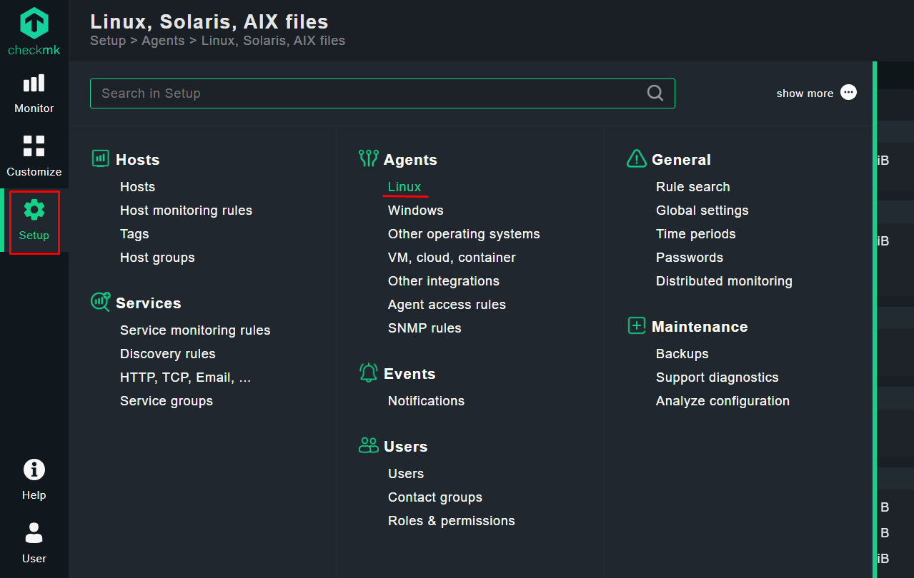
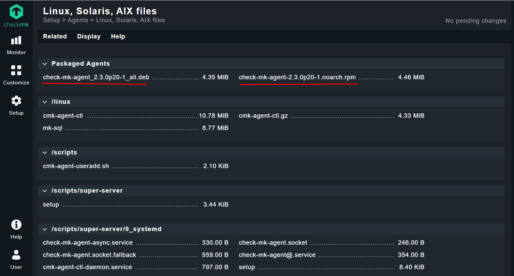
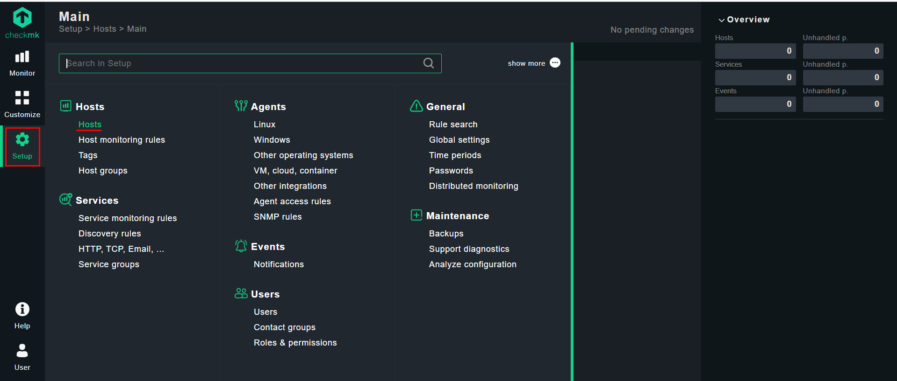
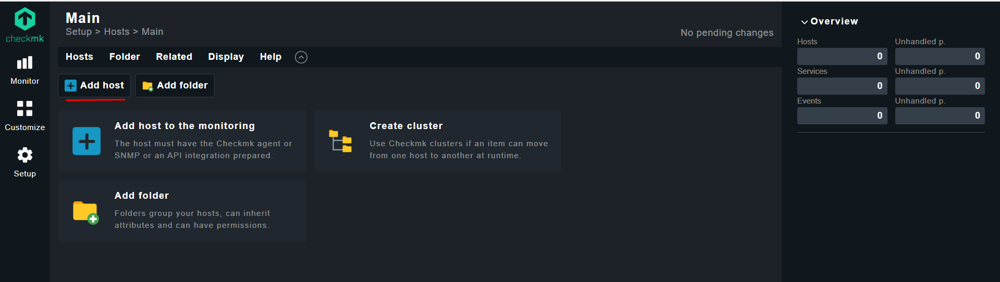
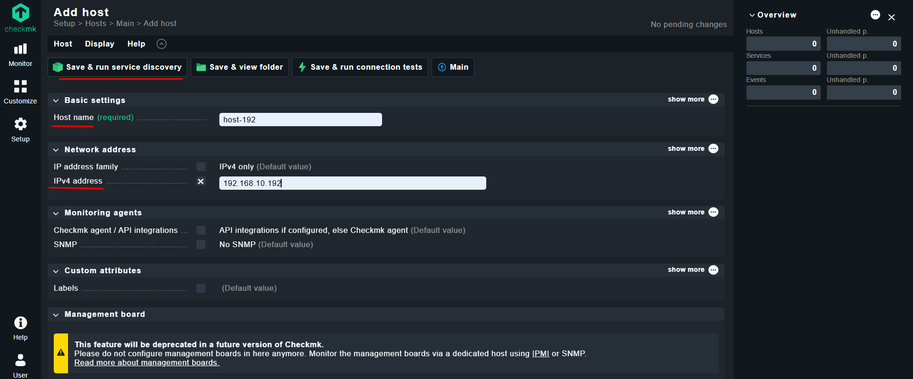
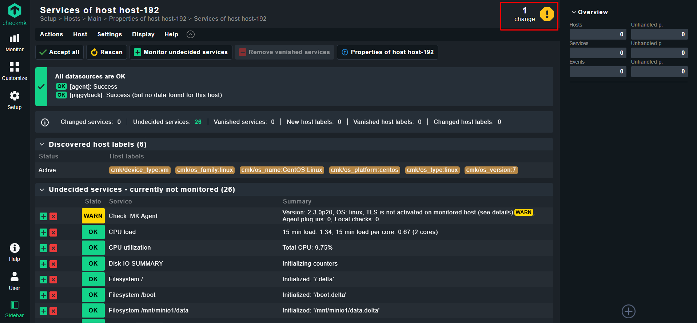
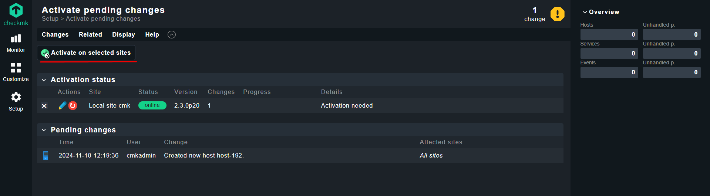
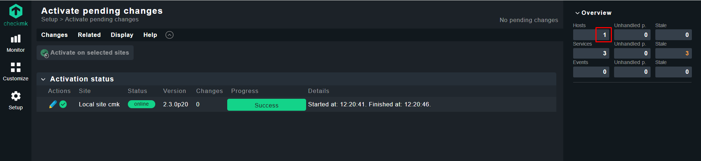

## Checkmk Installation as a Docker container:


### Docker Run Checkmk:

- `-p 8080:5000` : By default the container’s web server listens on port 5000. In this example port 8080 of the Docker node will be published to the port of the container so that it is accessible from outside.
- `-p 8000:8000` : Maps port 8000 in the container for distributed monitoring or Livestatus.
- `--tmpfs /opt/omd/sites/cmk/tmp:uid=1000,gid=1000` : For optimal performance, you can use a temporary file system directly in the RAM of the Docker node. The path for this file system is specified with this option. If you change the site ID this path must also be edited accordingly. Ensures the filesystem uses the specified user/group IDs.
- `-v ./monitoring:/omd/sites` : This stores persistent data like configuration and logs.
- `-v /etc/localtime:/etc/localtime:ro` : Ensures the container's timezone matches the host's timezone. The ro flag makes it read-only.


_Run Docker Container:_
```
docker run --name monitoring -dit -p 8080:5000 -p 8000:8000 --tmpfs /opt/omd/sites/cmk/tmp:uid=1000,gid=1000 -v ./monitoring:/omd/sites -v /etc/localtime:/etc/localtime:ro --restart always checkmk/check-mk-raw:2.3.0-latest
```


```
docker logs -f monitoring
```


```
### Output:

### CREATING SITE 'cmk'
Adding /opt/omd/sites/cmk/tmp to /etc/fstab.
Going to set TMPFS to off.
Temporary filesystem already mounted
Updating core configuration...
Generating configuration for core (type nagios)...
Precompiling host checks...OK
Executing post-create script "01_create-sample-config.py"...OK
Executing post-create script "02_cmk-compute-api-spec"...OK
Skipping Apache restart.
Created new site cmk with version 2.3.0p20.cre.

  The site can be started with omd start cmk.
  The default web UI is available at http://dd303f29d83d/cmk/

  The admin user for the web applications is cmkadmin with password: RV0l1krEMDXl
  For command line administration of the site, log in with 'omd su cmk'.
  After logging in, you can change the password for cmkadmin with 'cmk-passwd cmkadmin'.
...
...

```


### Web Console:

By default, the interface is available at `http://<server_ip>:port/<site_name>/` like `http://192.168.10.192:8080/cmk/`

- Username: `cmkadmin`
- Password: Automatically generated; can be found in the setup logs or reset using:


### Download and Install Agent:

1. Setup -> under Agents section `Linux` : 

  

  


```
wget http://192.168.10.192:8080/cmk/check_mk/agents/check-mk-agent-2.3.0p20-1.noarch.rpm
```


```
yum install xinet* -y
```


```
rpm -ivh check-mk-agent-2.3.0p20-1.noarch.rpm
```


### Add Host on Checkmk Server:

1. Setup -> under Hosts section `Hosts` -> click `Add host` : 

  

  

  

  

  

  


### Links:
- [Checkmk Installation as a Docker container](https://docs.checkmk.com/latest/en/introduction_docker.html)
- [Checkmk | Docker Hub](https://hub.docker.com/r/checkmk/check-mk-raw/)
- [Downloading & Installing Checkmk](https://checkmk.com/download)
